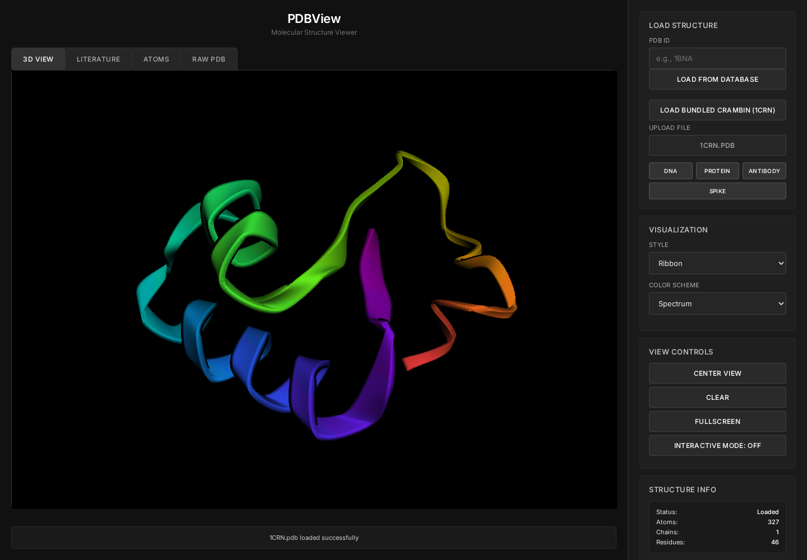

# pdbview

PDBView is a browser-based molecular structure viewer built on [3Dmol.js](https://3dmol.org/).

Live demo: https://mottopanikeiku.github.io/pdbview/

The question: can a small static page make a PDB structure easy to inspect without installing molecular visualization software?

[`index.html`](index.html) and [`styles.css`](styles.css) provide the viewer and controls; [`script.js`](script.js) loads structures, applies representations, and displays atom records and source text. Load the bundled crambin example, upload a local `.pdb` file, or fetch a structure by ID from the [RCSB Protein Data Bank](https://www.rcsb.org/). Drag to rotate, scroll to zoom, and use the style and color menus to change the representation.

## Result

The bundled [1CRN structure](data/1CRN.pdb), downloaded from [RCSB](https://files.rcsb.org/download/1CRN.pdb), contains 327 atom records. The [browser smoke test](tests/smoke.spec.cjs) loads it through the UI under `/pdbview/`, checks the model and non-background rendered pixels, changes style and color, filters the atom table, opens raw PDB text, and uploads the same file. It fails on console errors, uncaught JavaScript exceptions, or failed network requests. This is a functional check, not a rendering-speed benchmark or a scientific validation of the structure.



## Run locally

Requires Node.js 22 or later and Python 3 for the optional static server. Rendering requires a WebGL-capable browser; the automated test uses Chromium with CPU software rendering. No GPU, account, API key, or paid compute is needed. Internet access is required to download packages and the two pinned, integrity-checked CDN libraries.

```sh
npm ci && npx playwright install --with-deps chromium
npm test
python3 -m http.server 8000
```

Open `http://localhost:8000/` after the third command. The automated test starts its own server at `http://127.0.0.1:48731/pdbview/`; no separate server is needed for tests. There is no application build step.

## Limitations

- Only PDB input is exposed by this UI; local uploads are limited to 50 MB.
- The bundled example needs no RCSB request, but the viewer still downloads its libraries from CDNs. Database lookup and publication metadata require RCSB access.
- Large structures may be slow, especially with sphere or stick representations on CPU software rendering.
- The smoke test covers Chromium, one small protein, and basic controls; other browsers and every interaction are not covered.
- This is an inspection tool, not a molecular simulation or structure-quality assessment.

## Deployment and prior work

[The workflow](.github/workflows/pages.yml) runs the browser smoke test on pull requests. On pushes to `main` or manual runs on `main`, it uploads only the public HTML, CSS, JavaScript, and bundled structure and deploys with GitHub Pages. The owner must select GitHub Actions as the Pages source; the workflow does not change repository settings.

Rendering and PDB parsing are provided by [3Dmol.js](https://github.com/3dmol/3Dmol.js); DOM helpers use [jQuery](https://jquery.com/). Structure data and optional publication metadata come from [RCSB PDB](https://www.rcsb.org/). The raw-text virtual grid is inspired by [Gabriel Petersson's fast-grid](https://github.com/gabrielpetersson/fast-grid), as noted in `script.js`.

The application is under the [MIT license](LICENSE); upstream libraries and PDB data retain their own licenses and terms.

Written with AI coding assistance.
