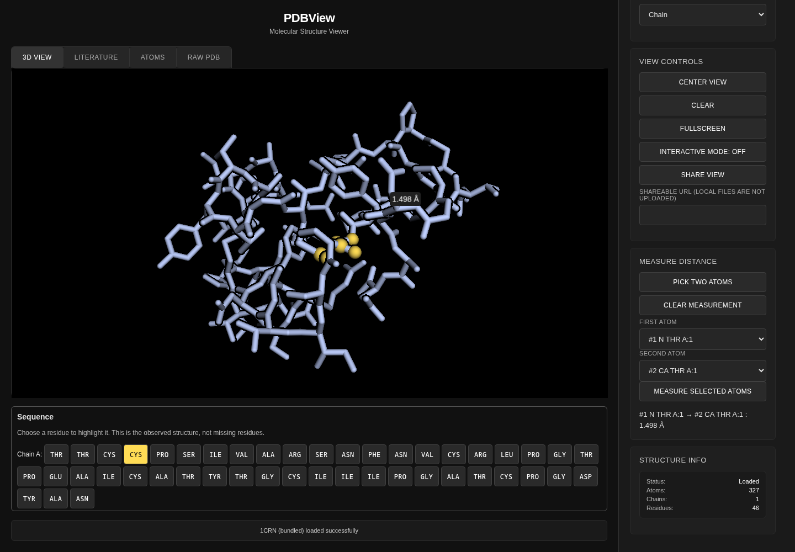

# pdbview

I built a browser PDB viewer on [3Dmol.js](https://3dmol.org/) to inspect a structure without installing molecular visualization software.

**[Open the viewer](https://mottopanikeiku.github.io/pdbview/)**. The bundled [crambin structure](data/1CRN.pdb) loads on arrival. I can fetch an RCSB PDB ID, upload or drop a local file, select an observed residue, measure the distance between atoms, and share the current view.



## What I can inspect

- **Structure:** enter a PDB ID and press Enter. Downloads come directly from [RCSB](https://files.rcsb.org/); `?pdb=1BNA` opens that entry.
- **Sequence:** click a residue in the strip to highlight it. Chain, residue number and insertion code identify the residue. The strip shows observed standard amino acids, not a full sequence reconstructed across missing coordinates.
- **Distance:** turn on **Pick two atoms**, then click two atoms in the structure. For precise or keyboard-only selection, choose atoms in the two selectors and press **Measure selected atoms**. The line and label show the Euclidean coordinate distance in ångströms. A third pick starts a new measurement.
- **Files:** drop one `.pdb` file anywhere on the page, or use the file chooser. Local coordinates stay in the browser; I do not upload them.
- **Sharing:** **Share view** produces a selectable URL containing the RCSB ID or bundled example, representation, color, camera, selected residue and measurement. Local files cannot be shared this way.
- **Keyboard:** Tab reaches controls and residues; Enter/Space activates native buttons. With the structure focused, arrow keys rotate, `+`/`-` zoom and `C` centers. Escape closes details and clears the measurement without unloading the structure.

[`script.js`](script.js) handles parsing, representations and data tabs. [`interactions.js`](interactions.js) connects the sequence, picking, distance and URL state. [`tests/features.spec.cjs`](tests/features.spec.cjs) checks those transitions in headless Chromium, including actual canvas picking, insertion codes, blank chains, dropped files, malformed input, load ordering, URL restoration and axe accessibility scans on desktop, mobile and the data tabs. The [arrival smoke test](tests/smoke.spec.cjs) checks that all 327 atoms in the bundled PDB render with colored pixels, exercises controls and rejects console errors. These are functional checks, not speed measurements or scientific validation.

## Run locally

I use Node.js 22 and a WebGL browser. Chromium tests use software rendering; no GPU, API key, account or paid compute is needed. Packages and pinned CDN libraries need internet access.

```sh
npm ci && npx playwright install --with-deps chromium
npm test
python3 -m http.server 8000
```

Open `http://localhost:8000/`. Tests start their own server under `/pdbview/`; there is no build step. CI runs the same browser suite and attaches screenshots. [Pages deployment](.github/workflows/pages.yml) publishes only the public app and bundled PDB after tests pass on `main`.

## Limits and sources

- PDB input only; local files are limited to 50 MB. Large structures and dense representations may be slow.
- Share links depend on atom ordering in the fetched PDB. They do not embed coordinates or publication data.
- The sequence excludes modified amino acids, nucleic acids and residues absent from the coordinates. Measurements use the parsed model, not symmetry mates or periodic boundaries.
- axe checks do not prove every accessibility need is met. I test Chromium, not every browser or assistive technology.
- This is an inspection tool, not a simulation or structure-quality assessment.

Rendering and parsing come from [3Dmol.js](https://github.com/3dmol/3Dmol.js); DOM helpers use [jQuery](https://jquery.com/). Structure data and optional publications come from [RCSB PDB](https://www.rcsb.org/). The raw-text virtual grid draws on [Gabriel Petersson's fast-grid](https://github.com/gabrielpetersson/fast-grid). My code is [MIT licensed](LICENSE); upstream libraries and PDB data retain their own terms.

Written with AI coding assistance.
